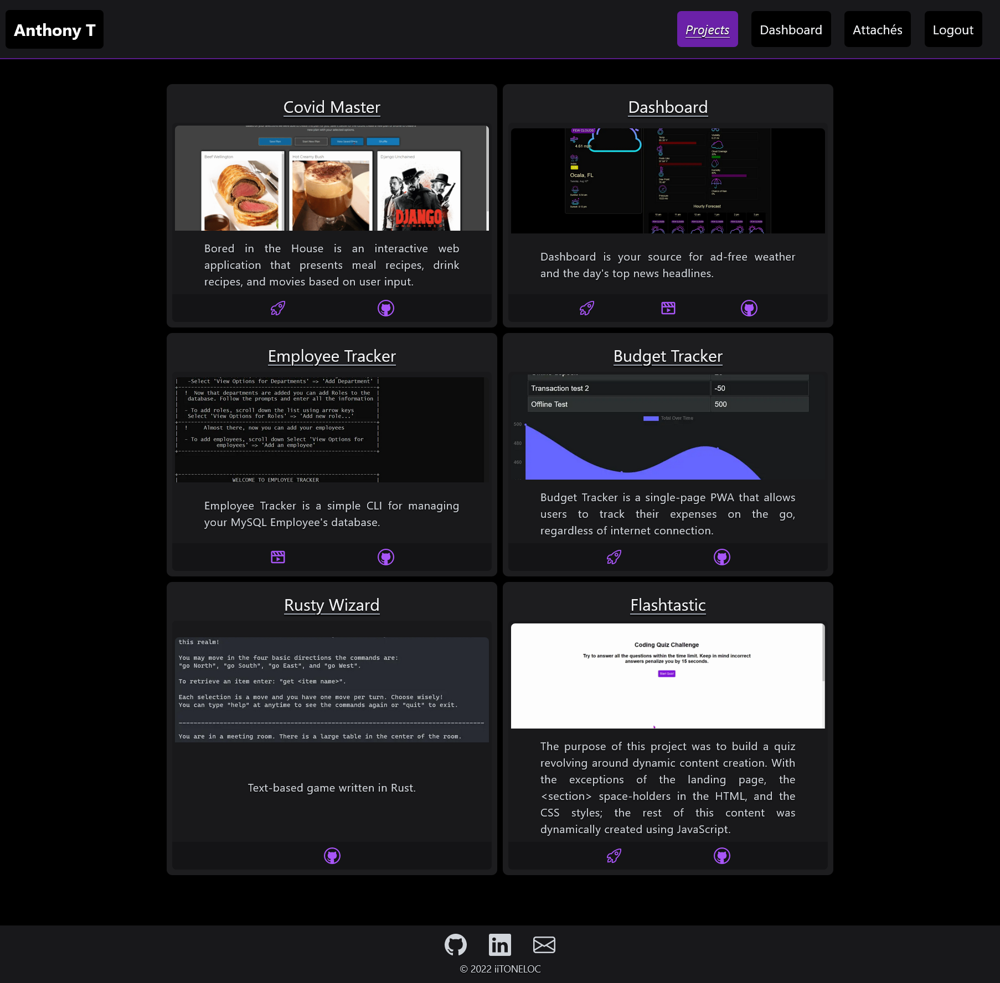

# &#128278; Attaché

# Screenshot


## &#128679; Coming Soon &#128679;

### &#128188;  *Portfolio and Resume Manager for Next.js*

## Table of Contents

- [Installation](#installation)
- [Usage](#usage)
- [License](#license)

## Installation

## &#128736;

1. Clone the repository

    ```bash
    git clone https://github.com/iiTONELOC/next-attache.git
    ```

2. Create the configuration file for the GitHubAPI.
    1. Authentication is required:
       1. create a [GitHub access token to authenticate your app](https://docs.github.com/en/authentication/keeping-your-account-and-data-secure/creating-a-personal-access-token).
       2. Run the script below replacing `GitHubUsername` with your username and `GitHubAccessToken` with your newly created token.

        ```bash
        npm run create-github -u GitHubUsername -a GitHubAccessToken
        ```

3. Create a .env.test file, be sure to replace username and auth with your GitHub username and previously created auth token.

     *Note*: This step is only necessary if you need to run the tests.

    * ## *`Powershell`*

        ```bash
        echo "GIT_HUB_USERNAME=username`nGIT_HUB_ACCESS_TOKEN=auth" > .env.test
        ```

    * ## *`Bash`*

        ```bash
        echo -e "GIT_HUB_USERNAME=username\nGIT_HUB_ACCESS_TOKEN=auth" > .env.test
        ```

## Usage

## &#128187;

- ### *`Development`*

    ```bash
    npm run dev
    ```

- ### *`Tests`*

    ```bash
    npm run test
    ```

- ### *`Lint`*

    ```bash
    npm run lint
    ```

- ### *`Build`*

    ```bash
    npm run build
    ```

- ### *`Start`*

    ```bash
    npm start
    ```

## LICENSE

## &#128190;

This project is licensed by the [MIT LICENSE](./LICENSE).
